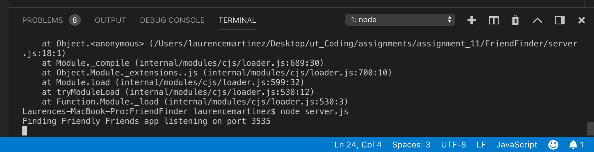
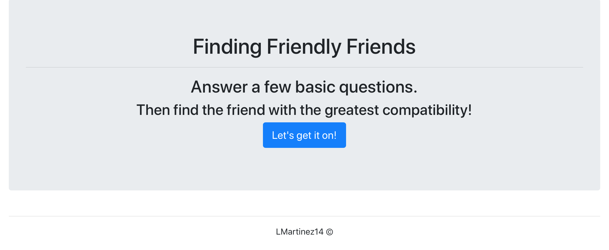
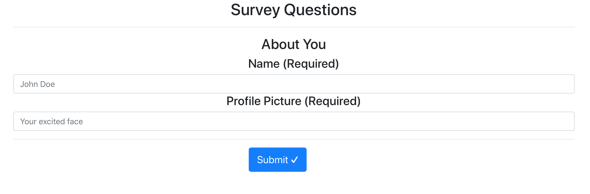

# FriendFinder
This full-stack site will take in results from the users' surveys, then compare their answers with those from other users. The app will then display the name and picture of the user with the best overall match.

## How to Use
When running, the js code will append 10 questions along with a dropdown to use a Likert scale. These options will be stored in an object that will be compared to other user's data to find the closest "match."

# Deployed through Heroku
Initial server must be listening through Heroku port by default and a node server is required. In the absence of a defined Heroku port, this app will run on port 3535.

# Problems Encountered
As you can see, the front end is available to view though the back end javascript is not completely functional.

# Screenshots

  </img>

 

  </img>

 

  </img>

